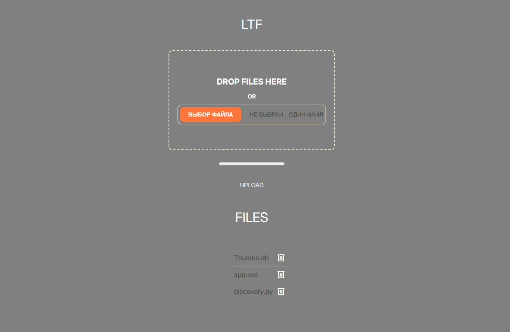

# Web Application API: Local Transfer Files (LTF)

LTF is designed for easy transfer of files on a local network

**Key Features**
1. Create Tasks: Users can add new tasks.

2. Retrieve Tasks: Users can get a list of all tasks or a specific task by ID.
3. Update Tasks: Users can update details of an existing task.
4. Delete Tasks: Users can delete tasks.
5. Filter Tasks: Users can filter tasks based on their status (e.g., pending, completed).

**API Endpoints**
1. GET / - Get a list of downloaded files and download files.

2. POST /uploads - Uploading a file.
3. GET /uploads - Get a list of all downloaded files.
3. GET /uploads/{filename} - Receiving a file.
4. DELETE /uploads/{filename} - Deleting a file.

